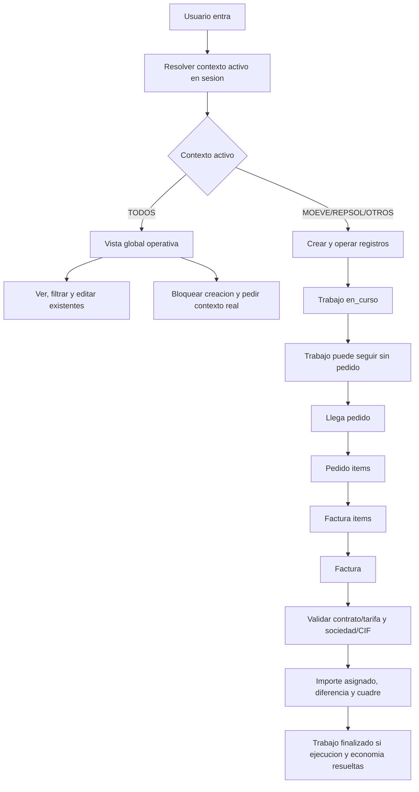

# Decisiones funcionales ERP CIETE 2026-05-03

> **Documento vivo.**  
> Este documento debe mantenerse alineado con la fuente de verdad funcional vigente del ERP CIETE.  
> Fuente principal: `docs/02_CLIENTE/reunionCieteCompletaFormato.txt`.

Estado: sintesis interpretativa secundaria vigente de la reunion y de las notas funcionales posteriores.

Este documento recoge las decisiones cerradas tras la revision de la reunion con CIETE y las matizaciones posteriores de Pablo. Debe usarse como sintesis interpretativa secundaria para implementar, revisar y defender el comportamiento funcional del ERP CIETE, pero no sustituye a la reunion/transcripcion como voz funcional primaria del cliente ni a la auditoria/backlog vigentes como traduccion operativa.

No sustituye ni borra documentos historicos, bitacoras ni planes anteriores. Cuando exista contradiccion entre este documento y la reunion/transcripcion, prevalece la reunion salvo que la discrepancia quede documentada como duda pendiente de decision.

## 1. Resumen ejecutivo

El ERP CIETE debe organizarse alrededor del trabajo como entidad operativa central, pero la unidad economica real es el item de pedido.

El sistema debe permitir trabajar antes de recibir pedido: un trabajo puede crearse, avanzar y marcarse como terminado sin pedido asociado. Los pedidos pueden llegar despues y un trabajo puede tener varios pedidos.

La facturacion no debe depender funcionalmente de un unico trabajo. La relacion principal es:

`factura -> factura_items -> pedido_items -> pedidos -> trabajos`

`facturas.id_trabajo` y `factura_pedidos` quedan como compatibilidad legacy, no como modelo funcional principal.

Los contextos reales son MOEVE, REPSOL y OTROS CLIENTES. TODOS no es un contexto real: es una vista global operativa segun permisos. Desde TODOS se puede ver, filtrar y editar registros existentes, pero no crear registros nuevos.

Ciete Excel es la vista diaria de trabajo: tabla densa, filtros, edicion por celda, guardado por campo, observaciones en modal y control optimista. Ciete Moderno conserva fichas, formularios y detalle limpio.

El ERP termina en factura. Cobros, presupuestos, legalizaciones completas e importacion avanzada quedan fuera del flujo critico inmediato.

## 2. Decisiones cerradas

### 2.1 Contextos

- MOEVE, REPSOL y OTROS CLIENTES son contextos reales.
- OTROS CLIENTES permite crear, editar y operar igual que MOEVE y REPSOL, ajustando campos y valores especificos cuando corresponda.
- TODOS no es un contexto real.
- TODOS no equivale a OTROS CLIENTES.
- TODOS es una vista global operativa segun permisos.
- Desde TODOS se puede ver, filtrar y editar registros existentes.
- Desde TODOS no se pueden crear registros nuevos directamente.
- Si el usuario intenta crear desde TODOS, el sistema debe bloquear la accion y pedir que seleccione un contexto real desde la topbar.
- Usuario con un solo contexto: no necesita selector desplegable, pero si debe ver un indicador claro del contexto activo.
- Usuario con varios contextos: cambia el contexto activo desde el selector de topbar.
- El contexto activo vive en sesion backend.
- Opcionalmente, el sistema puede recordar el ultimo contexto usado entre sesiones para mejorar la experiencia.

### 2.2 Roles

- Admin queda como rol tecnico/soporte.
- Admin no es la figura operativa normal de CIETE.
- Direccion es rol funcional operativo.
- Direccion y admin tecnico pueden gestionar usuarios.
- Direccion no debe ver botones, accesos o pantallas tecnicas innecesarias de admin.
- Roles funcionales principales:
    - Direccion.
    - Ejecucion.
    - Ejecucion MOEVE.
    - Ejecucion REPSOL.
    - Contabilidad.
    - Soporte/admin tecnico.

### 2.3 Estaciones

- La columna principal es el codigo de estacion.
- El codigo preferente es de 6 caracteres.
- El codigo debe permitir letras y numeros.
- El codigo debe mantener flexibilidad para casos raros.
- Se puede permitir un prefijo preestablecido desde UI, sin cambiar la estructura de base de datos.
- El codigo puede repetirse entre contextos/clientes distintos.
- El codigo no puede repetirse dentro del mismo contexto/cliente.
- Columnas principales del listado:
    - Codigo estacion.
    - Nombre estacion.
    - Municipio.
    - Provincia.
- La fecha de baja se conserva, pero no se muestra como columna protagonista.
- Las estaciones nunca se borran fisicamente.
- Una estacion dada de baja puede mantener trabajos historicos.
- Una estacion dada de baja puede recibir trabajos si operativamente aplica.

### 2.4 Trabajos

- El trabajo es la entidad operativa central.
- Un trabajo puede existir sin pedido.
- Un trabajo puede tener varios pedidos.
- Un pedido pertenece a un solo trabajo.
- Estado inicial funcional: `en_curso`.
- Estados funcionales:
    - `en_curso`.
    - `terminado`.
    - `pendiente_facturar`.
    - `facturado`.
    - `finalizado`.
    - `cancelado`.
- `terminado` significa que el tecnico ha terminado la ejecucion.
- `finalizado` significa que el trabajo esta terminado y economicamente resuelto, facturado y cuadrado.
- El cobro lo gestiona otro departamento.
- El ERP CIETE termina en factura.
- Reabrir no es flujo normal.
- Si aparece algo nuevo tras finalizar/facturar, normalmente se crea otro trabajo.
- La reapertura, si existe, debe ser restringida y auditada.
- Los cancelados deben seguir visibles, filtrables y ubicados al final por prioridad visual.

### 2.5 Ciete Excel y Ciete Moderno

- Ciete Excel es la forma operativa diaria.
- Ciete Excel debe ser tabla densa, con muchos registros visibles, filtros y edicion por celda.
- Ciete Excel guarda solo el campo modificado.
- Ciete Excel no debe guardar la fila completa.
- Las observaciones en Ciete Excel se editan mediante modal corporativo.
- Los conflictos de edicion simultanea se muestran como aviso inline, similar a una validacion de formulario/login.
- No debe haber sobrescritura silenciosa.
- El control optimista debe hacerse por campo usando `updated_at`.
- Ciete Moderno mantiene fichas, formularios y pantallas de detalle limpias.
- Ciete Moderno no debe convertirse en una tabla Excel.
- Ambos modos trabajan sobre los mismos datos.

### 2.6 Pedidos e items

- `pedido_item` es la unidad economica y facturable real.
- Los pedidos pueden llegar despues del trabajo.
- Un pedido pertenece a un unico trabajo.
- Un pedido puede contener varios items.
- Los items pueden venir de contrato/tarifa.
- Un item puede facturarse parcialmente.
- Los items no deben borrarse y recrearse si pueden estar vinculados a facturacion.
- Los items deben actualizarse por ID.
- Deben conservarse historico y referencias.

### 2.7 Facturacion

- La relacion principal es:

    `factura -> factura_items -> pedido_items -> pedidos -> trabajos`

- `facturas.id_trabajo` queda nullable y legacy.
- `factura_pedidos` queda temporal y legacy.
- Una factura puede incluir items de varios pedidos.
- Una factura puede incluir items de varios trabajos.
- Todos los items de una factura deben pertenecer a contrato/tarifa compatible.
- La sociedad/CIF debe estar permitida para el contrato/tarifa/grupo correspondiente.
- El listado plano de facturas debe mostrar:
    - Numero de factura.
    - Sociedad.
    - CIF.
    - Fecha.
    - Importe.
    - Importe asignado.
    - Diferencia.
    - Estado de cuadre.
- Debe poder exportarse el listado filtrado o seleccionado.
- Debe poder exportarse una factura individual con detalle completo si se desea.
- Cobros quedan fuera del flujo principal.

### 2.8 Contratos, tarifas, grupos y CIF

- Lo economico lo manda el contrato/tarifa.
- MOEVE, REPSOL y OTROS CLIENTES funcionan como agrupaciones operativas/fiscales.
- Empresas/sociedades/CIF representan entidades fiscales/facturadoras dentro de un grupo.
- Debe existir una relacion de sociedades permitidas por contrato/tarifa.
- Los contratos antiguos o inactivos se conservan para historico.
- Los contratos antiguos o inactivos no se ofrecen para nuevas operaciones.

### 2.9 Auditoria

- El nombre visible del modulo es Auditoria.
- Auditoria muestra por defecto solo actividad operativa relevante.
- No se auditan como actividad relevante cambios de:
    - `interface_mode`.
    - Tema visual.
    - Idioma.
    - Preferencias visuales.
    - Otros cambios cosmeticos o de experiencia.
- Exportar logs: solo Direccion.
- Limpiar logs: solo Direccion.
- La limpieza debe registrar:
    - Usuario que limpio.
    - Fecha y hora.
    - Filtros aplicados.
    - Numero de registros afectados.
- El registro de limpieza no puede borrarse en la misma operacion de limpieza.

### 2.10 Fuera de alcance inmediato

- Legalizaciones completas quedan fuera del flujo critico.
- Legalizaciones pueden ser informativas, pero no deben bloquear el flujo principal inmediato.
- Presupuestos y hoja de pedido quedan fuera de alcance inmediato.
- Importacion Excel avanzada queda como P2.
- Cobros quedan fuera del flujo principal.
- Documentacion antigua contradictoria se conserva como historica o superada, no se borra.

## 3. Mapa funcional del ERP

Flujo operativo esperado:

1. Usuario entra al ERP.
2. El sistema resuelve contexto activo desde sesion.
3. Si el usuario tiene un solo contexto, se muestra indicador.
4. Si el usuario tiene varios contextos, puede elegir MOEVE, REPSOL, OTROS CLIENTES o TODOS.
5. Desde un contexto real se pueden crear trabajos, pedidos, facturas, estaciones y maestros permitidos.
6. Desde TODOS se pueden ver, filtrar y editar registros existentes segun permisos, pero no crear.
7. Se crea un trabajo en estado `en_curso`.
8. El trabajo puede seguir sin pedido.
9. Cuando llega el pedido, se asocia al trabajo.
10. El pedido se descompone en `pedido_items`.
11. El tecnico marca el trabajo como `terminado` cuando la ejecucion esta hecha.
12. Facturacion selecciona items compatibles.
13. La factura agrupa `factura_items`.
14. Se valida contrato/tarifa y sociedad/CIF permitida.
15. Se calcula importe asignado, diferencia y estado de cuadre.
16. Si ejecucion y facturacion quedan resueltas, el trabajo puede pasar a `finalizado`.
17. Auditoria registra los cambios operativos relevantes.

## 4. Reglas por modulo

### Contextos

- Backend es la fuente de verdad del contexto activo.
- La UI puede recordar preferencias, pero no sustituye la sesion backend.
- TODOS debe tratarse como modo de vista global, no como contexto persistible.
- Todo `store` de entidad contextual debe fallar si el contexto activo es TODOS.
- Todo `update` de entidad existente debe permitirse desde TODOS si el usuario tiene permiso y acceso al contexto real del registro.

### Usuarios

- Direccion debe gestionar usuarios sin depender de pantallas tecnicas innecesarias.
- Admin tecnico debe existir para soporte/desarrollo.
- La UI debe explicar roles, contextos y permisos con lenguaje operativo.

### Estaciones

- El listado principal prioriza codigo, nombre, municipio y provincia.
- Direccion/ubicacion y fecha de baja quedan en detalle o segundo nivel visual.
- Las estaciones se desactivan o marcan, no se borran fisicamente.

### Trabajos

- La creacion no requiere pedido.
- El estado inicial debe ser `en_curso`.
- Marcar `terminado` debe registrar fecha de terminacion si aplica.
- `terminado` no equivale a cerrado.
- Tener factura no equivale por si solo a finalizado.
- `finalizado` requiere ejecucion terminada y economia resuelta.
- Cancelados no desaparecen del historico.

### Pedidos

- Pedido requiere trabajo.
- Trabajo puede tener varios pedidos.
- Pedido no puede pertenecer a varios trabajos.
- Los importes pedido, solicitado y facturado deben conservarse y poder contrastarse.

### Items de pedido

- Se actualizan por ID.
- No se borran/recrean cuando hay riesgo de vinculacion a factura.
- Deben soportar facturacion parcial.

### Facturas

- La seleccion de items es el corazon del flujo.
- La factura debe poder agrupar items de varios pedidos y trabajos.
- La compatibilidad economica se valida por contrato/tarifa.
- La sociedad/CIF se valida contra las sociedades permitidas.
- El listado plano debe ser exportable.
- El detalle de factura debe poder exportarse individualmente.

### Auditoria

- El registro debe centrarse en actividad operativa.
- Los cambios cosmeticos no deben aparecer como actividad relevante.
- El modulo debe ser entendible por Direccion.

## 5. Decisiones de seguridad/permisos

- TODOS permite operar registros existentes solo si el usuario tiene permiso sobre la accion y acceso al contexto real del registro.
- Crear desde TODOS queda bloqueado en backend y explicado en UI.
- Direccion y admin tecnico pueden gestionar usuarios.
- Direccion no debe navegar por herramientas tecnicas si no aportan valor operativo.
- Exportar y limpiar Auditoria queda reservado a Direccion.
- Reapertura de trabajos queda restringida y auditada.
- Borrado fisico de estaciones queda prohibido.
- Acciones destructivas sobre historico deben sustituirse por anular, cancelar, desactivar o archivar segun modulo.

## 6. Decisiones de auditoria

La Auditoria debe registrar cambios utiles para direccion, control interno y trazabilidad operativa.

Debe registrar:

- Usuario.
- Fecha y hora.
- Contexto.
- Modulo.
- Entidad.
- Registro.
- Campo modificado cuando aplique.
- Valor anterior.
- Valor nuevo.
- Accion.
- Descripcion comprensible.

No debe considerarse actividad operativa relevante:

- Cambio de modo Ciete Excel/Ciete Moderno.
- Cambio de tema visual.
- Cambio de idioma.
- Cambio de preferencias visuales.
- Cambios cosmeticos similares.

La limpieza de logs debe:

- Estar limitada a Direccion.
- Registrar quien la ejecuta.
- Registrar filtros aplicados.
- Registrar numero de registros afectados.
- Conservar el propio registro de limpieza en la misma operacion.

## 7. Decisiones fuera de alcance

Quedan fuera de alcance inmediato:

- Cobros como flujo principal.
- Presupuestos.
- Hoja de pedido.
- Legalizaciones completas.
- Importacion Excel avanzada.
- Actualizacion automatica de estaciones.
- Costes e imputacion avanzada.

Estos modulos pueden existir en el sistema o en documentacion historica, pero no deben bloquear la alineacion funcional de trabajos, pedidos, items y facturas.

## 8. Implicaciones tecnicas

Estas decisiones implican:

- Endurecer todas las altas contextuales para bloquear creacion desde TODOS.
- Mantener edicion desde TODOS para registros existentes si hay permiso y contexto accesible.
- Tratar OTROS CLIENTES como contexto real completo.
- Ajustar estados de trabajos para que `en_curso` sea estado inicial funcional.
- Mantener `borrador` y `cerrado` solo como compatibilidad si existen datos legacy.
- Evitar hard delete en estaciones y entidades con historico.
- Cambiar facturacion al flujo principal por `factura_items`.
- Mantener `factura_pedidos` e `id_trabajo` como legacy temporal.
- Crear o consolidar relacion de sociedades/CIF permitidas por contrato/tarifa.
- Actualizar `pedido_items` por ID, sin borrar/recrear referencias facturables.
- Excluir cambios visuales/cosmeticos del registro operativo de Auditoria.
- Revisar permisos para que Direccion y admin tecnico tengan responsabilidades separadas.

## 9. Que documentos quedan superados o compactados

Los documentos historicos no se borran. Cuando contradigan este documento, deben marcarse como historicos, superados o pendientes de alineacion.

Documentos compactados o alineados tras esta decision:

- `docs/README.md`: indice canonico.
- `docs/BIBLIA_DESARROLLO.md`: guia tecnica viva compactada.
- `docs/03_API_ERP/Trabajos_API_Contract.md`: contrato tecnico vigente.
- `docs/02_CLIENTE/01_Alcance_y_No_Alcance.md`: alcance vigente resumido.
- `docs/02_CLIENTE/02_Requisitos_y_Acuerdos.md`: requisitos vigentes resumidos.
- `docs/02_CLIENTE/tareasComparar.md`: backlog P0/P1/P2 vigente.
- `docs/02_CLIENTE/historicos/Analisis_Reunion_CIETE_Plan_2_Sprints_2026-05-04.md`: historico compactado.
- `docs/02_CLIENTE/historicos/Tareas_Pablo_01_02_Mayo_2026.md`: historico compactado.
- `docs/05-SPRINTS/**`: planes marcados como historicos cuando aplicaba.

Reglas permanentes:

- Cualquier documento que llame a TODOS "solo consulta" queda superado.
- Cualquier documento que trate cobros como flujo principal queda superado.
- Cualquier documento que presente admin como rol operativo normal de CIETE queda superado.
- Las bitacoras se conservan intactas como historico de trabajo.

## 10. Proximas tareas P0/P1/P2

### P0

1. Cambiar facturacion al modelo funcional por `factura_items`.
2. Validar contrato/tarifa comun en todos los items facturados.
3. Validar sociedad/CIF permitida por contrato/tarifa/grupo.
4. Evitar borrado/recreacion de `pedido_items`; actualizar por ID.
5. Bloquear creacion desde TODOS en todas las entidades contextuales.
6. Alinear estados de trabajos con los estados funcionales cerrados.
7. Excluir cambios visuales de la Auditoria operativa relevante.

### P1

1. Ajustar permisos de Direccion y admin tecnico.
2. Sustituir borrados fisicos por desactivar/cancelar/anular donde haya historico.
3. Pulir estaciones: columnas principales y detalle secundario.
4. Extender control optimista a mas modulos si se editan tipo Excel.
5. Implementar exportacion de listado de facturas filtrado/seleccionado.
6. Implementar exportacion individual de factura con detalle.
7. Revisar Ciete Moderno para que conserve ficha limpia sin arrastrar estados legacy visibles.

### P2

1. Importacion Excel avanzada.
2. Legalizaciones completas.
3. Presupuestos/hoja de pedido.
4. Actualizacion automatica de estaciones.
5. Costes e imputacion avanzada.
6. Integraciones futuras con cobros si CIETE lo decide mas adelante.
