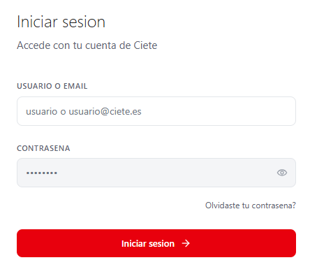
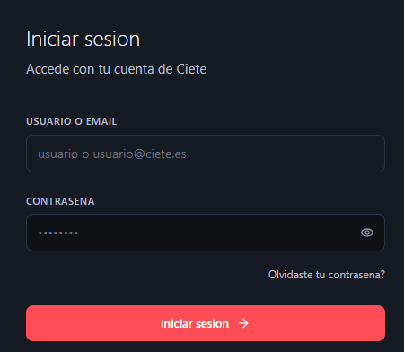
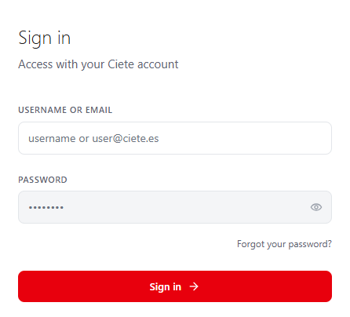
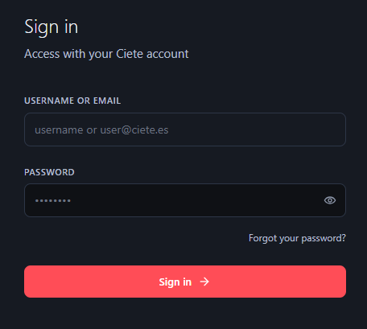
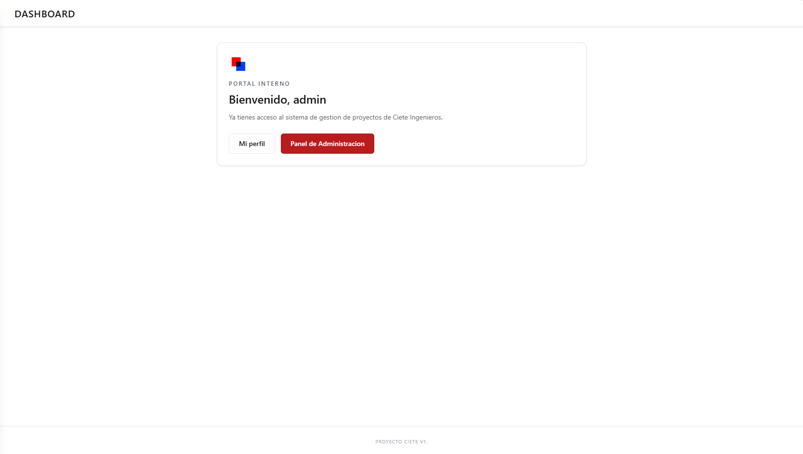
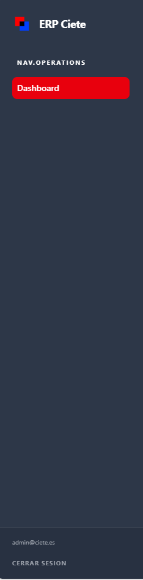
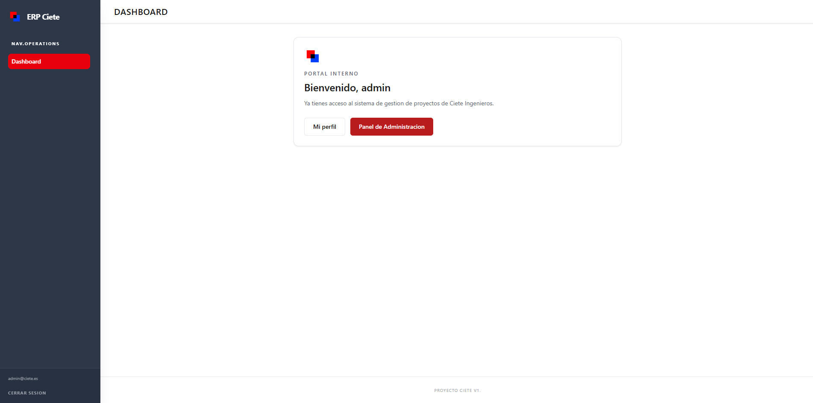

# Frontend - Sprint 1

## 1. Pantalla de Login

La aplicación dispone de cuatro variantes de la pantalla de inicio de sesión, adaptadas según el idioma (español/inglés) y el tema visual (claro/oscuro).

### Variantes disponibles:
- Español - Tema claro  
- Español - Tema oscuro  
- Inglés - Tema claro  
- Inglés - Tema oscuro  

---

| Español - Claro | Español - Oscuro |
|----------------|------------------|
|  |  |

| Inglés - Claro | Inglés - Oscuro |
|----------------|------------------|
|  |  |

---

## 2. Dashboard

El dashboard constituye la vista principal de la aplicación tras el inicio de sesión del usuario.

Desde esta pantalla se presenta la información más relevante del sistema, permitiendo una visión general rápida y facilitando el acceso a las distintas funcionalidades disponibles.

  

---

## 3. Sidebar (Menú lateral)

La aplicación dispone de un sidebar (menú lateral) que permite la navegación entre las diferentes secciones del sistema.

Este componente facilita el acceso rápido a las funcionalidades principales y mejora la experiencia de usuario al proporcionar una estructura clara y organizada.

  

---

## 4. Navegación

La navegación de la aplicación se realiza principalmente a través del sidebar, permitiendo al usuario desplazarse entre las distintas vistas de forma intuitiva.

El flujo principal de uso es el siguiente:
- Inicio de sesión (Login)
- Acceso al dashboard
- Navegación a diferentes secciones mediante el menú lateral

Este enfoque garantiza una experiencia de usuario fluida y coherente.

  

